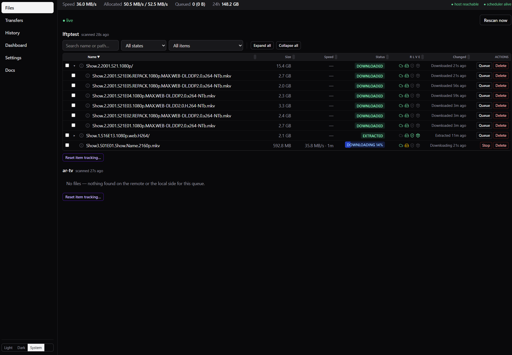
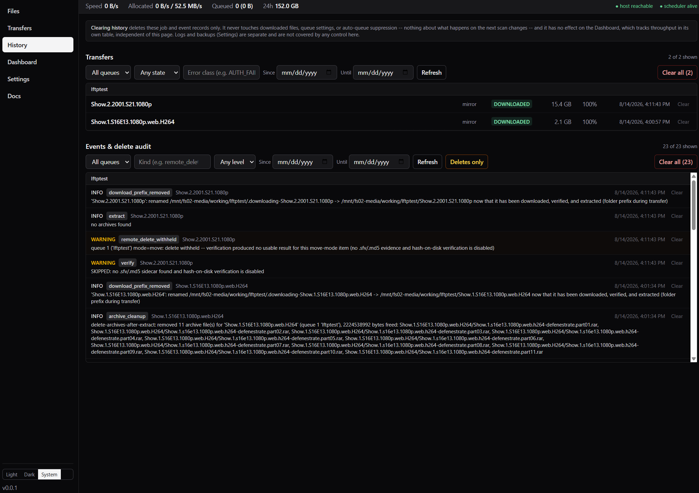

# lftpweb

A containerized web interface for keeping a local directory in sync with a seedbox, using
**lftp** as the transfer engine over SSH/SFTP.

Browse the remote and local trees as one view, queue and supervise downloads with live
progress, auto-queue on patterns, and optionally verify, extract, and relocate finished items.

> ## Beta
>
> **Version `0.2.1`.** All 9 build phases are built, covered by backend unit and integration
> tests plus a frontend unit suite, and exercised manually through the UI against a real
> seedbox. This is a **beta** — there is no upgrade path guaranteed between beta releases,
> and the database schema may still change between them. See
> "Known gaps" below before pointing it at anything important.

## How it works

**lftp is a transfer engine, not a status API.** Every transfer is its own short-lived `lftp`
process, handed one job and left alone. Nothing asks lftp how it is going — progress is derived
from the filesystem, comparing local bytes against the remote size the last scan recorded.

That one decision is why a wedged transfer cannot lie about its progress, why every transfer
resumes from its partial bytes, and why restarting the container mid-transfer costs seconds
rather than a re-download. The obvious alternative — one long-running lftp polled with `jobs -v`
— was tried and rejected: that output is meant for humans, and it takes the whole queue with it
when the process dies.

**[How it works](docs/how-it-works.md)** covers the rest in about two minutes: how an item gets
queued, where status actually comes from, and why. It is also in the running app under
**Docs → How it works**. [`DESIGN.md`](DESIGN.md) §1.2 and §1.3 have the long version.

## Screenshots

Remote and local as one tree, with live per-file progress, speed, and ETA:



Every verify outcome, every remote delete, and every delete withheld — with the reason:



**[More screenshots →](docs/screenshots.md)**

## What works today

- Connect to a seedbox over SSH/SFTP; browse the remote tree alongside the local one
- Named **path queues** — one remote → local mapping each, with their own settings
- Queue transfers manually, watch live progress, stop them, resume from the partial;
  multi-select with shift-range and bulk Queue/Stop/Delete that reports partial failure
  honestly ("7 of 10 queued, these 3 failed because …"), plus text/state/"missing only" filters,
  on the Files page. The delete dialog offers two independent, checkbox-driven scopes — Delete
  local copy, and (2026-08-16) Delete source (seedbox), the first manual remote-delete in the
  app, for cleaning up a failed or never-imported item without SSHing into the seedbox by hand.
  Local defaults on and Source defaults on for a `move` queue (off for `copy`, with a warning if
  checked anyway — its remote path isn't guaranteed to be a hardlink pickup directory). Every
  scope is guarded (path containment, no active job, mount sentinel; a manual source delete
  refuses rather than stopping a live transfer) and confirmed before it runs — irreversible,
  unlike Queue/Stop. A local delete marks the whole subtree, and picks each row's state from
  whether a remote copy actually survives
- Files rows carry four lifecycle icons (**R**emote / **L**ocal / **V**erified / **E**xtracted —
  presence facets may go dark, milestones stay lit), an inline progress bar inside the state
  chip, when the row last changed state, and an info icon that opens a detail drawer with both
  sides' size and modified date, the lifecycle chronology, and recent transfers and audit
  events. The tree sorts by name / size / last change / percent complete, and remembers your
  sort and your expand-or-collapse choice across reloads
- Optional scheduled retention: delete local copies older than N days, off by default, with a
  dry-run preview endpoint (no Settings-page toggle yet — see "What doesn't yet")
- Bandwidth ceiling and concurrency limits with an admission-control scheduler; per-queue scan
  intervals (10s / 30s / 60s / on-demand-only), on an engine loop that scans only the queues
  actually due and cannot stack a second scan of a queue over its own overrun
- Auto-queue on select/skip/file-exclude patterns, with a live "what would this match" preview
- **A settle gate, on by default**: a release still being uploaded to the seedbox is held until
  its remote fingerprint (file count, total bytes, newest mtime) holds still across two
  consecutive scans *and* at least 60 seconds of wall clock. Without it, a directory caught
  mid-upload can read as byte-complete off whichever files arrived first — and then be
  extracted, relocated, and (on a `move` queue) deleted from the remote with files still
  missing. It costs up to about a minute per transfer; switch it off at Settings → Transfer if
  your seedbox's landing path is atomic end to end
- **Folder prefix during transfer, on by default**: a directory item downloads into a
  hidden-by-convention folder (`.downloading-<name>` by default, configurable site-wide and
  per-queue) and is renamed to its real name only once the transfer is fully complete, so an
  importer (Sonarr, Radarr, Plex, Jellyfin — anything that skips dot-prefixed folders) can never
  see a partial multi-file release mid-arrival. Single-file downloads are unaffected — there's no
  partial window for that shape. See Settings → Transfer
- Post-processing: verify (sidecar or hash-on-disk, which now also checks total bytes so it
  cannot bless a truncated file), extract (`7zz` for zip/7z/tar/gz/bz2/xz, `unrar` for rar/rar5
  — see `NOTICE`), and `move` mode's remote delete — fired only after the *last* enabled check
  passes (completeness → verify → extract → *arr import when tracked), all with an audited trail
  on the History page. Extraction stages into `_UNPACK_` and merges into place only on full
  success, is gated on cheap filesystem preconditions first (zero-length head volume, a gap in a
  multi-volume rar set), and can optionally delete a release's spent archive volumes once they
  have extracted — off by default
- **Optional Sonarr/Radarr integration** (`docs/arr-integration-spec.md`, off at every level by
  default): bind a queue to a Sonarr or Radarr instance from Settings → Integrations and lftpweb
  closes the whole loop — it watches that instance's download queue for a matching release,
  badges the row with the real Sonarr/Radarr logo while the release moves through download,
  verify, and extract, tells the *arr "your files are here, import now" once post-processing
  succeeds, and then waits for the *arr to *fully* confirm the import (its own queue record
  finished plus import history, held for two consecutive checks — never on an ambiguous signal)
  before doing any cleanup. On a `move` queue the **seedbox source is deleted only after that
  confirmed import** — files exist on both sides until the *arr has the release, so any failure
  is inspectable on both ends — and the optional per-queue "Delete when imported" toggle then
  removes the local working copy too, leaving the row visible with a "Processed" countdown
  before it ages out. The logo chip carries the outcome everywhere (Files, Transfers, History):
  green check once imported, red mark if a release left the *arr's queue without ever importing
  (filterable on its own, since that one usually needs a look). Stragglers are cleaned up from
  the app: the delete dialog offers independent **Local** and **Source (seedbox)** scopes, so
  failed or abandoned releases can be cleared from both sides without ever SSHing in
- The History page: every completed/failed/cancelled transfer and every audit event
  (including remote deletes and deletes withheld), filterable and grouped by queue
- Rotating log viewer, on-demand `VACUUM INTO` database backups (scheduled + manual), and a
  header readout for seedbox reachability and scheduler liveness (`/api/health`)
- Credentials encrypted at rest
- **Authentication is optional and defaults off** (`AUTH_MODE=none`) — turn on a single-user
  password login or trust a reverse proxy's identity header, both from Settings → Auth. See
  "Locked out?" below before you flip it on.
- **In-app user documentation**, under **Docs** in the left nav: a quick start walking the real
  first-run sequence, and a Concepts page covering the eight things that actually confuse people
  (the settle gate, the removal grace period, auto-queue suppression, the difference between
  Dismiss / Clear history / Reset item tracking, the lifecycle icons, `copy` vs `move`,
  inherit-vs-override on the post-processing toggles, and the Sonarr/Radarr icon). Every step
  links straight to the settings page it describes.
  Per-field help popups (`FieldHelp`) are being applied across the settings surface, starting
  with the fields whose wrong answer costs you data

## Support bundle

**Settings → Logs → "Support bundle…"** builds one downloadable zip to attach to an issue or
send manually — generating one is recorded in the audit trail like every other diagnostic
action here. It **captures**: lftpweb's own logs (already credential-redacted at write time,
`logsetup.py`), a build/environment snapshot, a sanitized settings dump, recent audit events and
job history, and — only for whichever Sonarr/Radarr instances you tick — each enabled instance's
own log files, fetched newest-first up to a per-instance size cap. It **never captures**: the
seedbox password, SSH keys, *arr API keys (a bundle carries only `has_*` booleans, the same as
every Settings response), archive extract passwords (a count, not the passwords), the SQLite
database itself, the install secret, or host-key pins. One caveat worth knowing before you
attach one anywhere public: an included *arr instance's log files are carried **exactly as that
*arr wrote them** — lftpweb doesn't rewrite another app's own logs — so give them a glance before
sharing. Full contents, one part per checkbox: **[docs/concepts.md](docs/concepts.md#support-bundle)**.

## What doesn't yet

All 9 build phases shipped (see `prompts/startnewsession.md` for exactly what each one built
and how it was verified), but real gaps remain:

| | Notes |
|---|---|
| Propagating local deletes to the seedbox (`sync` mode) | Designed (`DESIGN.md` §7) but **not scheduled** — built only if it proves wanted. `sync`'s own primary use case ("the importer took it, clean up the source") is now served without building it: `move`-with-the-delete-ladder plus the Files page's manual delete dialog (Delete source, above) cover it — see `DESIGN.md` §7's own note. |
| Local retention (delete-local-files-older-than-N-days) has no Settings-page UI | Backend, API (including a dry-run preview), and the background scheduler all exist (2026-08-12) and default off; only the settings screen to turn it on hasn't shipped yet — same "backend first" gap as the settle gate and Settings → Transfer before it. |

See "Known gaps" below for the rest — behavioral limitations and deliberate trade-offs, as
opposed to the unbuilt UI above.

## Known gaps

Named here rather than fixed silently or left to be rediscovered — deliberate scope reductions
and known limitations, recorded in full in `docs/decisions.md` and `prompts/open-issues.md`:

- **Post-processing only runs when a job this app spawned succeeds, or when the settle gate
  releases a hold.** A file that arrives another way (a manual `cp`, a restore) is never
  verified, extracted, or — on a `move` queue — deleted from the remote, until something
  re-touches the item.
- **Encrypted-rar password retry has never been tested against a real encrypted archive.** No
  RAR compressor exists in this project's toolchain, so the fixture can't be built. The
  equivalent 7zz path *is* tested against a real encrypted zip; the rar path is assumed correct
  by analogy, which is weaker than every other claim here.
- **History date filters are UTC calendar days.** No timezone handling exists anywhere —
  timestamps are stored UTC and rendered with `toLocaleString()`. Away from UTC, "yesterday" can
  include a few hours of today.
- **API keys and session tokens are hashed with SHA-256, not argon2id.** Deliberate: a key is
  256 bits of `secrets.token_urlsafe`, not a guessable secret, so argon2's slowness would add
  latency and buy nothing.
- **Login timing isn't normalized between "unknown username" and "wrong password."** Both return
  an identical body and are rate-limited identically; only wall-clock timing differs, and only
  under repeated probing.
- **`password` auth mode with no user configured is open access, not a lockout** — see "Locked
  out?" below. Deliberate, since the alternative bricks the instance on a typo, but anyone
  reaching the API while no user row exists is in.
- **An abandoned `.downloading-` directory with no tracking history can't be deleted from the
  UI.** It is visible (the scan maps it to its logical name), but "Delete local" resolves the
  physical path from the item's recorded prefix, and an orphan predating any job has none. The
  realistic case — a stopped, failed, or `CORRUPT` item — is fully deletable. A directory left by
  a wiped database is not; remove it by hand. Note dot-prefixed directories are also skipped by
  `rm -rf *`.
- **A terminal removed row has no individual reset.** Once a row lands on `REMOVED_BOTH` with
  nothing in either tree it stops being published, so the Files page has no checkbox for it.
  Reset item tracking's **All** and **Pattern** scopes both reach it; only the per-item scope
  cannot target one on its own.
- **`net:connection-limit` can't be set from the UI.** It lives only in the `host` row's
  `connection_overrides` JSON blob with no write path anywhere, so Settings → Transfer's
  "over the limit" warning can never fire on a current install.
- **The item drawer's "actual local path" panel (folder-prefix-during-transfer's physical
  location) only appears from the Files page.** `TransfersPage.tsx` opens the same drawer but
  doesn't have the owning queue's `local_path` loaded, so that one panel simply doesn't render
  there — every other section of the drawer is unaffected.
- **The Sonarr/Radarr integration UI has never been click-tested in a browser.** No agent that
  built it (backend, notify/cleanup, or this UI pass) can render a page — see `docs/decisions.md`
  for the standing reason every Settings page in this project carries the same caveat. The item
  drawer also doesn't surface `arr_status` yet; only the Files-row icon and its hover text do.

## Locked out?

`AUTH_MODE` defaults to `none` — a fresh pull of this image, or an existing install that has
never visited Settings → Auth, behaves exactly as if auth didn't exist. If you turn on
`password` mode and get locked out (forgot the password, or the container starts refusing you
for any other reason), there are two independent ways back in — no browser needed for either:

1. **Set `LFTPWEB_AUTH_MODE=none`** (or `password`/`proxy`, to force a specific mode) as a
   container environment variable and restart. This overrides whatever is stored in the
   database, unconditionally, until you unset it again. Fastest if you can edit your compose
   file / restart the container.
2. **Delete the local user row directly**, if you have shell/DB access but don't want to
   restart:
   ```bash
   sqlite3 /config/lftpweb.db "DELETE FROM auth_user"
   ```
   With `password` mode on and no user configured, lftpweb treats that as open access rather
   than rejecting every request forever — sign back in via Settings → Auth to create a fresh
   user once you're in. **Say this plainly: this is a deliberate fail-open, not a fail-closed.**
   Between the `DELETE` and creating a fresh user, anyone who can reach the API has full
   access, no password required — the trade this project makes is that a five-second mistake
   (or, on a shared host, someone else's access) recovering the instance beats a five-second
   `DELETE` permanently bricking it. See "Known gaps" above.

Both routes are exercised by `tests/test_auth_api.py::test_lockout_recovery_env_var_override`
and `::test_lockout_recovery_delete_user_row`, not just documented here.

## Running it

Requires Docker and a seedbox you can reach over SSH.

```bash
docker compose up -d          # production-shaped
docker compose -f docker-compose.dev.yml up --build    # local development
```

The UI is on **`8087`** (`5187` for the Vite dev server). Configure the host and your path
queues under **Settings**.

**Once it's up, the rest of the setup guide is in the app**, under **Docs → Quick start** — it
walks connecting to the seedbox, creating a queue, the first scan, and queueing a transfer, with
every step linking to the page it describes. **Docs → Concepts** explains the behaviours that
surprise people (why a transfer waited a minute before starting, why an item won't re-download,
and what the three different "clear this" actions each actually remove). That lives in the app
rather than being repeated here on purpose: duplicated prose drifts, and only the in-app copy can
link you to the setting it's talking about. The same two pages are also plain Markdown you can
read straight from this repo without deploying anything — see
[`docs/quick-start.md`](docs/quick-start.md) and [`docs/concepts.md`](docs/concepts.md)
(indexed, alongside the project's engineering records, in [`docs/README.md`](docs/README.md)).

| Volume | Holds |
|---|---|
| `/config` | SQLite database, logs, backups, encryption key |
| `/downloads` | where lftp writes and what the reconciler scans (`local_path`) — this is the download target, not a landing zone that gets relocated out of. A directory item downloads into a hidden-prefixed subfolder here first (`.downloading-<name>`, "Folder prefix during transfer" in Settings → Transfer, on by default) and is renamed to its real name only once complete — still under `/downloads` throughout, never a second volume |
| `/staging` | optional; the *destination* a `move`-mode queue's post-processing step relocates a verified, finished item **to**, once it's fully downloaded and verified in `/downloads`. Labeled "Final destination" in Settings → Queues to match this — see `docs/decisions.md`'s phase 5 entry for why this reads backwards from the field's own name (`staging_path`) |

`PUID` / `PGID` / `UMASK` are honored, which matters if your downloads live on an NFS share —
see `DESIGN.md` §11.2.

## Design

**[`DESIGN.md`](DESIGN.md)** is the architectural source of truth, in 15 numbered sections.
Worth reading §1.3 before anything else, because the whole codebase follows from it:

> **lftp is a transfer engine, not a status API.** Progress is derived from the filesystem —
> local bytes on disk versus known remote size — and each transfer is its own short-lived lftp
> process.

[SeedSync](https://github.com/nitrobass24/seedsync) is the prior art and is worth your time if
you want something that works today. lftpweb shares no code with it; §1.2 explains what was
learned from it and where this deliberately diverges.

Non-obvious decisions, with their rejected alternatives, are logged in
[`docs/decisions.md`](docs/decisions.md).

## Development

```bash
uv run pytest                                        # test suite
docker/test-seedbox/gen_key.sh                       # throwaway key, not committed
docker compose -f docker-compose.test.yml up -d      # fake seedbox to test against
```

The fake seedbox is two sshd containers seeded with an identical known-size tree — one with GNU
`findutils`, one with busybox — so both remote-scan paths get exercised for real.

## Licence

**[AGPL-3.0](LICENSE)** — if you run a modified lftpweb as a service for other people, you have
to publish your changes.

The container image also bundles third-party programs — unmodified Alpine packages (lftp,
OpenSSH, 7-Zip, su-exec, tini) plus `unrar`, built from RARLAB source in the image's builder
stage — each under its own licence. lftpweb runs them as separate processes rather than linking
against them. See [`NOTICE`](NOTICE).
