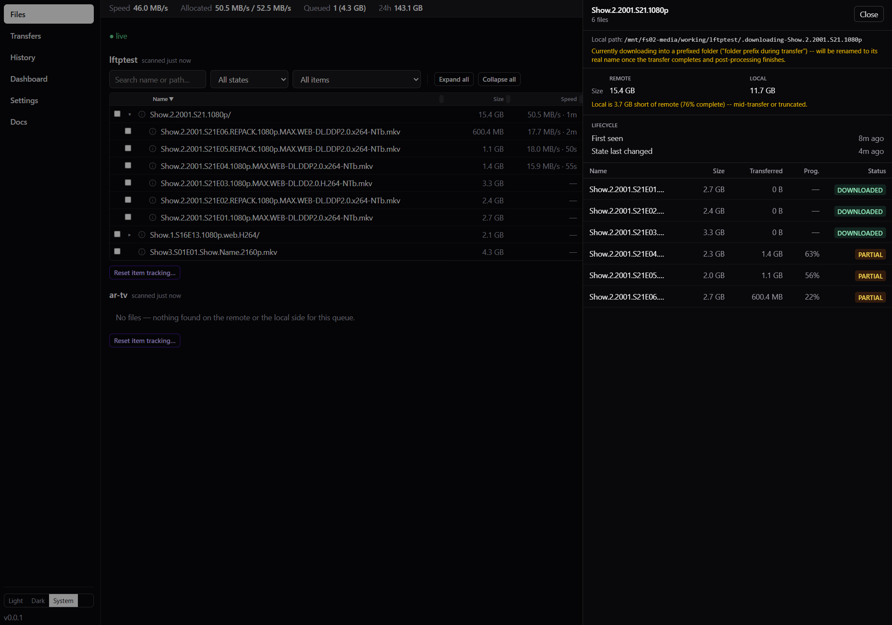
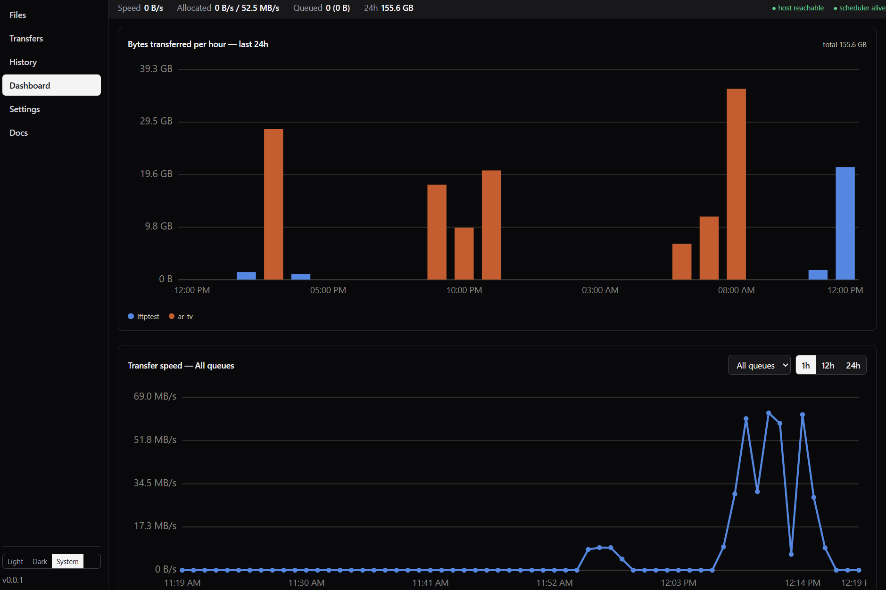
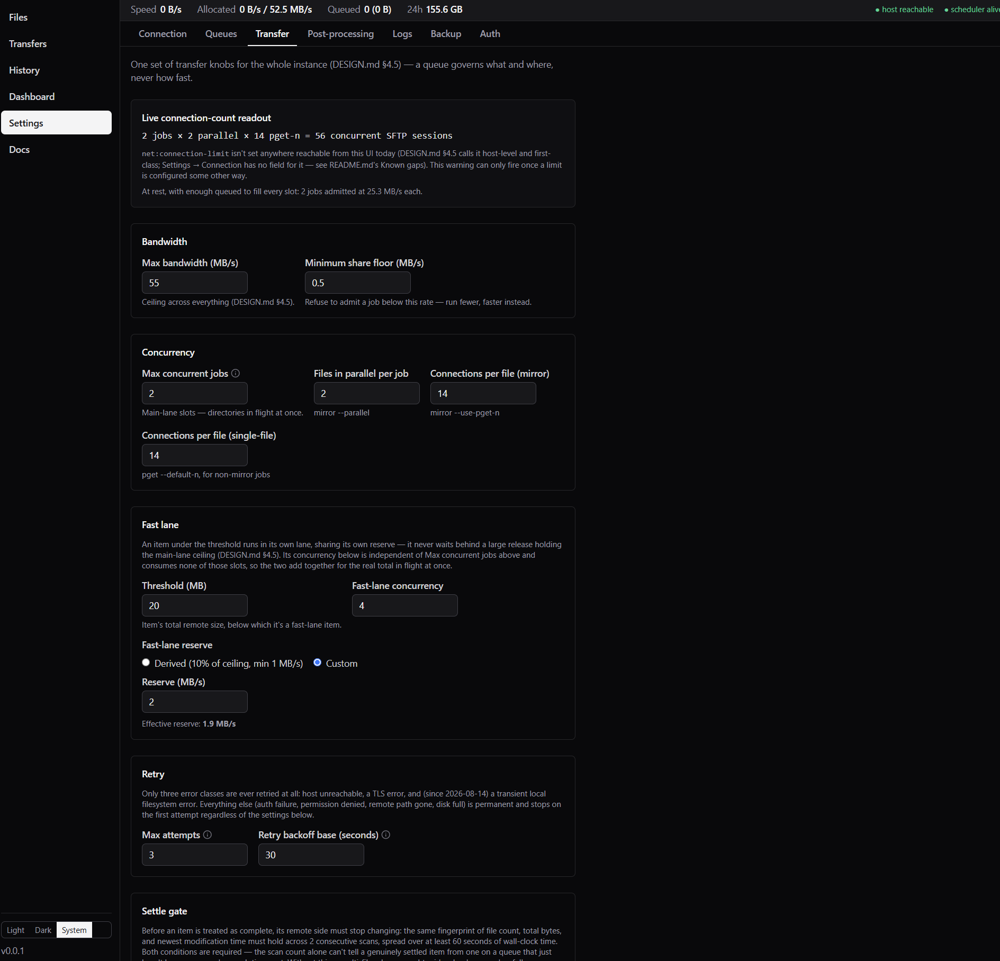
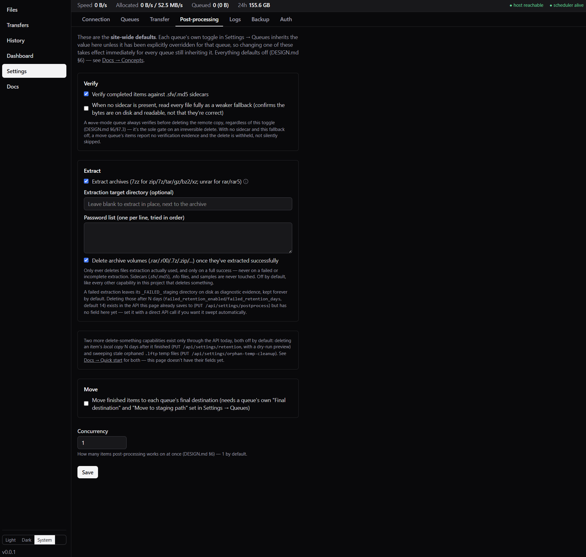

# Screenshots

The two shots in [`README.md`](../README.md) answer "what is this, and does it work?" and "can I
trust it?". This page is everything else — the screens you spend time in once it's running.

All captured against a real seedbox with deliberately generic release names.

## The redesigned Queue tab

Transfers is the main section now, with **Queue** and **Files** as tabs beneath it. The Queue
tab is one globally-ordered list — no more one section per queue, because admission was always
global and grouping implied per-queue lines that never existed.

Two boxes, each paginated with its own 10/20/50 page-size selector: **Active/pending**, which
holds a row until its *whole pipeline* finishes, not just its transfer — a downloaded release
waiting on a confirmed Sonarr/Radarr import reads **Awaiting import** here, not Complete, for
exactly as long as that's true — and **Complete**, everything actually finished. Each row carries
a queue badge, a fast-lane badge when it qualifies, and **▲ / ▼ / ▲▲** reordering; a directory row
expands to the same per-file progress the Files page shows, without leaving this page to see it.

## Pausing the queue to curate the order

**Pause after current** lets whatever's running finish and admits nothing new; **Pause now** also
stops in-flight transfers immediately, leaving them resumable — not cancelled, not counted as
stopped. The point of pausing is visible in this shot: reordering (the same ▲ / ▼ / ▲▲ chevrons)
keeps working the whole time, so you stop everything, click the item you actually want next to
the top of the queue, and unpause. "Start now" is the one control turned off here —
oversubscribing past the ceiling to force one item through would defeat the pause you just
asked for.

## What one item is actually doing

The drawer answers "what is happening to this, exactly". Remote and local size side by side, with
the gap stated plainly — *"Local is 3.7 GB short of remote (76% complete) — mid-transfer or
truncated"* — then the lifecycle timestamps, then every file in the release with its own size,
bytes transferred, percentage, and state.

Note the local path: `…/lftptest/.downloading-Show.2.2001.S21.1080p`. A directory downloads into a
hidden-by-convention folder and is renamed to its real name only once the transfer **and**
post-processing have succeeded, so an importer watching that directory can never see a release
that is incomplete or unverified. The drawer says so rather than leaving you to wonder why the
path looks odd.

Behind it, the Files tree shows the same release expanded: each episode carries its own live rate
and ETA, because progress is sampled per file rather than for the job as a whole.

The drawer's header also carries an **Events** link straight to this item's own filtered audit
trail — one click further than the bounded recent-history panel already shown here, for when you
need the unbounded log rather than the last handful of entries.

## Throughput over time

Bytes transferred per hour over 24 hours, split by queue, and a live transfer-speed chart with
1h / 12h / 24h ranges. Both are drawn from lftpweb's own sampling table, independent of the
Events page — clearing events does not touch them.

## Transfer tuning, and what it actually means

One set of transfer knobs for the whole instance: a queue governs *what and where*, never *how
fast*.

Two things worth pointing out, because both are the kind of detail that normally has to be learned
the hard way:

- **The live connection-count readout** — `2 jobs × 2 parallel × 14 pget-n = 56 concurrent SFTP
  sessions`. Seedboxes have connection limits; this tells you what your settings actually mean
  before you hit one.
- **The fast lane is additive.** Its concurrency is independent of *Max concurrent jobs* and
  consumes none of those slots, so the two add together for the real total in flight. That is
  stated on the page rather than left to be discovered when you set "2" and see three transfers
  running.

The Retry section names exactly which failures are retried — host unreachable, TLS, and a
transient local filesystem error — and says everything else is permanent and stops on the first
attempt.

## Post-processing defaults

The site-wide defaults for verify, extract, and move. Each queue inherits these unless it has
explicitly overridden that one toggle, so changing a default here takes effect immediately for
every queue still inheriting it. Everything defaults off.

The wording carries the safety rules rather than hiding them in a manual: a `move`-mode queue
always verifies before deleting the remote copy regardless of the toggle, because that is the sole
gate on an irreversible delete; archive cleanup only ever removes files extraction actually used,
and only on a full success — never a failed or incomplete one; sidecars, `.nfo` files and samples
are never touched.

It also states plainly which capabilities exist only through the API today and have no field on
the page yet, rather than quietly omitting them.
